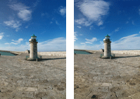

# Comparing images in Go



The library compares images by perceptual similarity to find near duplicates and
resized images. To get an idea how the algorithm works try a JavaScript implementation for
[similar image search](https://www.similar.pictures).

`Similar` function gives a verdict whether 2 images are similar or not.

The library also contains wrapper functions to open/save images (`open.go`,
`save.go`) and basic image resampling/resizing (`resample.go`).

## Example of image comparison (2 photos)
```
package main

import (
	"fmt"
	"log"

	"github.com/vitali-fedulov/images"
)

func main() {
	imgA, err := images.Open("photoA.jpg")
	imgB, err := images.Open("photoB.jpg")
	if err != nil {
		log.Println(err)
	}
	masks := images.Masks()
	hA, imgSizeA := images.Hash(imgA, masks)
	hB, imgSizeB := images.Hash(imgB, masks)
	if images.Similar(hA, hB, imgSizeA, imgSizeB) {
		fmt.Println("Images are similar.")
	} else {
		fmt.Println("Images are distinct.")
	}
}
```

## Algorithm for image comparison

[Detailed explanation with illustrations](https://www.similar.pictures/algorithm-for-perceptual-image-comparison.html).

Summary: In the algorithm images are resized to small squares of fixed size.
A number of masks representing several sample pixels are run against the resized
images to calculate average color values. Then the values are compared to
give the similarity verdict. Also image proportions are used to avoid matching
images of distinct shape.
